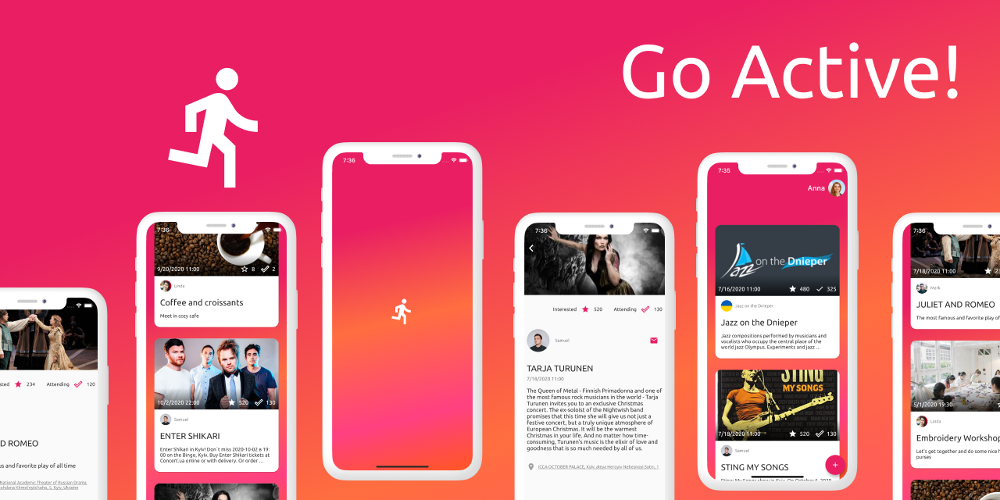

# goactive



This repository contains a sample social event tracking app built with
[Flutter](https://flutter.dev/)

## 💻 Launching

The app does not use the real backend, hence no additional steps
required. You may launch the app with
```bash
flutter packages get
flutter run
```

To run tests use
```bash
flutter test
```

## ✨ Features

* Loading events list
* Pagination loading
* Portrait/landscape mode
* Interested/Attending flags
* Creating new events
* Editing own events

## 💥 Tech features

* Architecture with `flutter_bloc`
* DI via `get_it` and `injectable`
* Navigation with `auto_route`
* Models generation with `freezed`
* Localization with `i69n`
* Custom fonts with `google_fonts`
* Generating app icon and name with `flutter_launcher_name` and
  `flutter_launcher_icons`
* Linting with `extra_pedantic`


## 👩‍💻 Author  

Created by [Anna Domashych](https://foxanna.github.io/)
