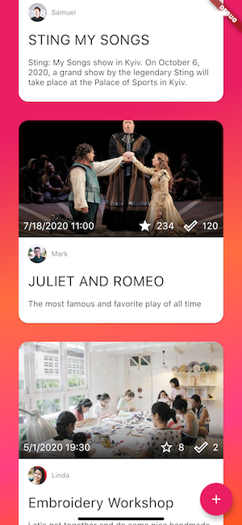
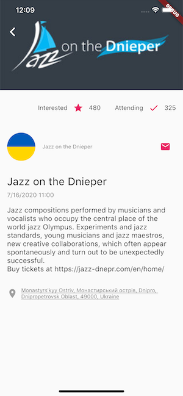

An example of mobile application developed with Flutter by [Anna Domashych](https://github.com/foxanna)

# goactive

This repository contains a simple event tracking sample app built with Flutter. 
It showcases the bloc architectural approach, models are autogenerated by freezed, DI implemented with injectable and get_it.

## 💻 Installation

In order to run the sample, platform-specific projects should be generated first. Run the following command in the root folder of the repo:

```bash
flutter create .
```

The app doesn’t use the real backend, hence to run the app no additional steps required. You may start the app with the following commands:
```bash
flutter packages get
flutter run
```

To run tests use the command:
```bash
flutter test
```

## ⭐️ Features

* Loading events list
* Pagination loading
* Interested/Attending flags
* Creating new events
* Editing own events

## 📷 Screenshots
 

